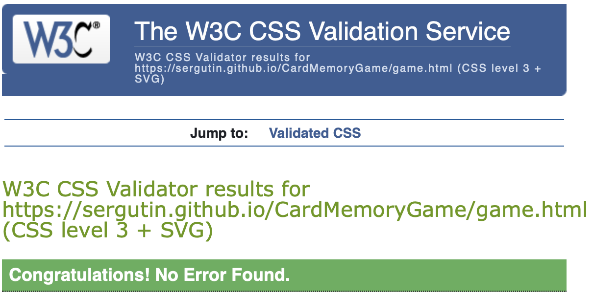
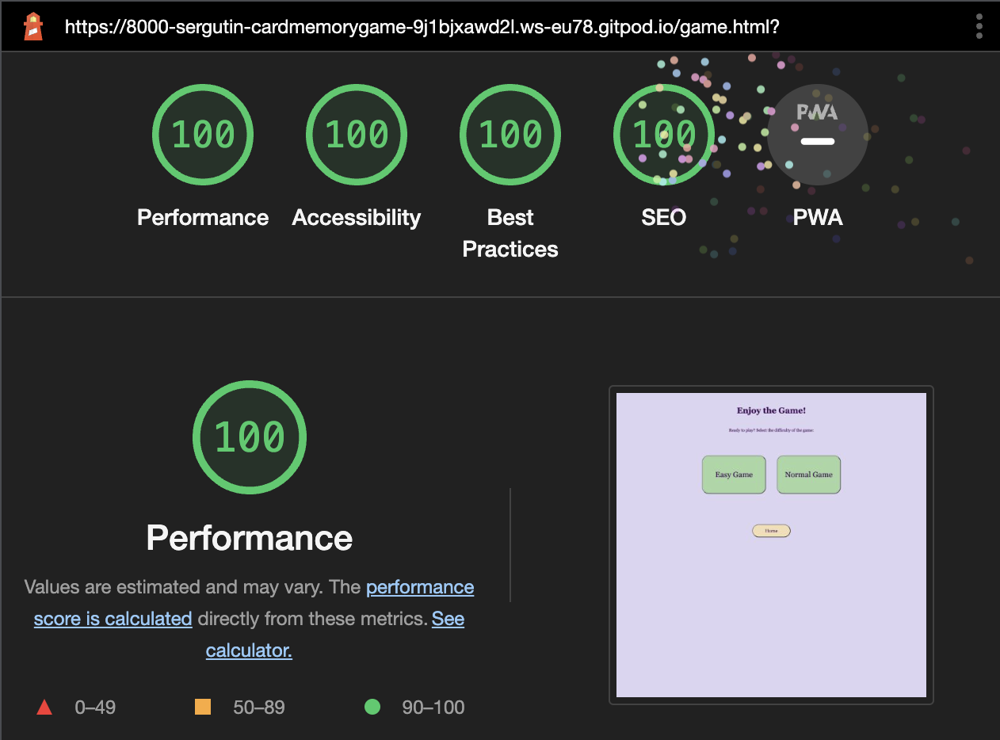

<h1>Card Memory Game</h1>

This project introduces an interactive website with Card Memory Game. This game alllows users to test their memory matching the pairs of cards with car manufacturer logos on them.

Target audience: children of all ages, especially those interested in cars and their logos.

* [Languages Used](#languages-used)
* [Features](#features)
  * [Main Page](#main-page)
  * [Game Levels](#game-levels)
  * [Home Button](#home-button)
  * [Easy Game](#easy-game)
  * [Normal Game](#normal-game)
  * [You Win Message](#you-win-message)
* [Testing](#testing)
  * [HTML](#html)
  * [CSS](#css)
  * [JSHint](#jshint)
  * [Lighthouse](#lighthouse)
  * [Manual Testing](#manual-testing)
  * [Fixed Bugs](#fixed-bugs)
  * [Unfixed Bugs](#unfixed-bugs)
* [Deployment](#deployment)
  * [Cloning and forking](#cloning-and-forking)
* [Media](#media)

## Languages Used

HTML5

CSS3

JavaScript

## Features

Responsive on all device sizes

Interactive elements

  ### Main Page

The main idea of the game is immediately evident to users, i.e. the landing page shows the image of the child playing cards with two matching cards in his hand.

This section provides a brief explanation of the game and allows users to easily start the game from the main page just clicking the "Let's Start the Game" button.

  ### Game Levels 

After clicking "Let's Start the Game" button users are getting moved to the next page where they can pick the level of the game: "easy" (2x2 cards) or "normal" (4x4).

  ### Home Button

At the bottom of the game page is located the "home" button, allowing users to open the main page of the game.

  ### Easy Game

After clicking the "Easy Game" button users see the card game field 2x2 cards with car image on the back side.

Player clicks on the cards to flip them over. If the two cards have the same image (car logo), then player continues with the next cards, otherwise the cards turn face down.

  ### Normal Game

After clicking the "Normal Game" button users see the card game field 4x4 cards with car image on the back side.

Player clicks on the cards to flip them over. If the two cards have the same image (car logo), then player continues with the next cards, otherwise the cards turn face down.

  ### You Win Message

Once all the pairs have been matched, user wins the game and receives "You Win!" message.

## Testing

  ### HTML 

No errors were returned when passing through the official W3C validator testing

  ### CSS 

No errors were found when passing through the official (Jigsaw) CSS validator

  ### JSHint 

No errors were found when passing through the official (JSHint) JavaScript validator.
Two unused variables "startEasyGame" and "startNormalGame" are being called using "button onclick" event from the Game page.

  ### Lighthouse

The website was measured using Lighthouse tool, performance 100% was calculated for desktop device and 100% for mobile device:

 

  ### Manual testing

Responsiveness was tested in different browsers:

<li>Chrome</li>

<li>Safari</li>

<li>Firefox</li>

Tests were completed in following browsers from mobile device (iOS):

<li>Chrome</li>

<li>Safari</li>

No broken links found, everything works as expected.

  ### Fixed Bugs

During the project there were a few bugs and errors that have been fixed.

<ul>
<li>Bug Number One: "You Win" window appeared every time after 2 matching pairs (for "easy" and for "normal" game as well, while for "normal" game it supposed to appear after 8 matching pairs rather than 2).</li>

Solution: JavaScript function matchCards was amended from:

to:

Additionally a global variable "level" was added with a default value of "null". It helped to solve the issue.

<li>Bug Number Two: Shuffle function didn't work properly for easy game, it was taking random cards from the whole array (8 cards) rather than from the first two cards.</li>

Solution: "shuffleCard" function was moved from "matchCard" function to the very beginning of the game, when users decides which game to play (easy / normal). Code with a bug:

Code after the fix:

<li>Bug Number Three</li>

Solution: .

</ul>

  ### Unfixed Bugs

There are no known unfixed bugs in the code

## Deployment

The site is deployed using GitHub Pages.

To deploy the site using GitHub Pages:

<ol>
<li>Login or signup to Github.</li>
<li>Go to the repository for this project, https://github.com/Sergutin/CardMemoryGame</li>
<li>At the top of the repository, locate the "Settings" button on the menu.</li>
<li>Select "Pages" section in the left hand menu.</li>
<li>From the "Source" dropdown select "Deploy from a Branch". Press "Save".</li>
<li>The site has now been deployed, please note that the process may take a few minutes before the site goes live.</li>
</ol>

  ### Cloning and forking

Forking a repository creates a copy of the original repository on GitHub account.
To fork a repository in GitHub:

<ol>
<li>On GitHub.com, navigate to the repository.</li>
<li>In the top-right corner of the page, click Fork.</li>

<li>Select an owner for the forked repository.</li>
<li>By default, forks are named the same as their parent repositories. You can change the name of the fork to distinguish it further.</li>
<li>Optionally, add a description of your fork.</li>
<li>Choose whether to copy only the default branch or all branches to the new fork. For many forking scenarios, such as contributing to open-source projects, you only need to copy the default branch. By default, only the default branch is copied.</li>
<li>Click Create fork.</li>
</ol>

Cloning a repository creates a copy of the original repository on our local machine.
To clone a repository in GitHub:

<ol>
<li>On GitHub.com, navigate to your fork of the repository.</li>
<li>Above the list of files, click  Code.</li>

<li>Copy the URL for the repository.</li>
<ul>
    <li>To clone the repository using HTTPS, click the "Copy" icon on the right of "HTTPS".</li>

<li>To clone the repository using an SSH key, including a certificate issued by your organization's SSH certificate authority, click SSH, then click the icon on the right to copy it.</li>
  <li>To clone a repository using GitHub CLI, click GitHub CLI, then click the "Copy" icon on the right.</li>
</ul>
</ol>

## Media

The main page image was taken from https://sightwords.com/images/memory/memory.jpg

The back card image of the car was adapted from https://pictures.dealer.com/c/currychevroletscarsdale/1429/5f5b6bc6d929fb8039c58ab125c0f7a7x.jpg?impolicy=downsize&w=568

Car logos were taken from https://similarpng.com/

"You Win" image was taken from https://pbs.twimg.com/media/Fg48ZrfXgAAiPR0?format=jpg&name=large
